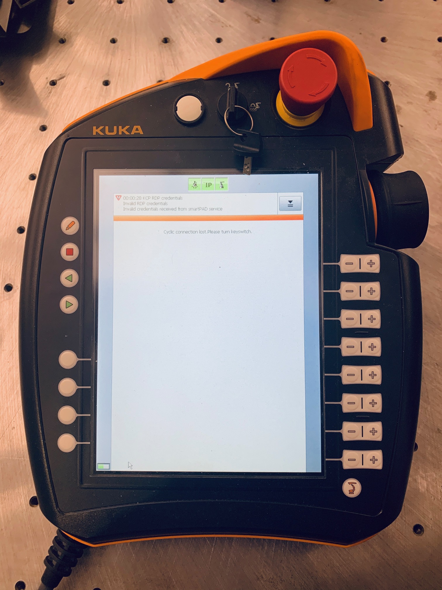

# Amazon UTC Wiki

## Hardware Setup

### Credential
The UTC consists of three operating systems: 
1. The workstation running Ubuntu 16.04; 
2. The KUKA Sunrise cabinet running Windows 7 Embedded; 
3. The onboard system embedded in the arm controller that runs JAVA programs on KUKA 

We have direct access to the first two OS, we can connect necessary I/O devices (monitor, mouse, keyboard) to interact with these systems.  

The red box shows the I/O ports on Sunrise cabinet  
  
This is the I/O ports area for  the workstation  
  

Red box shows the power button for Sunrise cabinet, green box shows the power button for workstation
 

The password for Ubuntu system is **********(*key1*) (Please contact the maintainer for password)  
The password for Windows 7 Embedded is ********(*key2*) (Please contact the maintainer for password)

*key1* will be used in any sudo actions on Ubuntu side.  
*key2* is used to log on the Windows 7 Embedded system but also needed for establishing RDP connection between the Smartpad and Windows 7 Embedded. 

### Establish RDP Connection
To use Smartpad teaching pedant, we need to establish RDP connection first:
1. Turn on the power of Sunrise cabinet
2. Make sure the upper key is in vertical position. Wait until the IP connection is established, make sure all three top icons are green.  
    
3. Press the button in red box to call out the menu, click RDP on the screen to enter credential page.  
    
4. Click the Password area to type the password (*key2*), make sure to delete all \* first.  
    
5. Wait for a while until you see the following interface, you can check various info of KUKA here.  
    
6. To run ROS node on the system, besides configuring correct ROS network (it should be configured correctly already), you also need to run the built-in JAVA program **ROSSmartServo**. Click the application button and choose **ROSSmartServo** in the drop menu. (You can try other sample programs here too if you like)  
    
7. Press the green trangle button to start the ROSSmartServo program and you will see the running log. Press the red square button to stop the program. You need to make sure the ROSSmartServo is running before you start ROS node or launch file on ubuntu.   
    

## Software Setup
Check here for a tutorial for implementing pick-and-place task using trajopt on KUKA 
https://industrial-training-local.readthedocs.io/en/demo3/_source/demo3/index.html

## Data Info
- Table height: 0.77153
- Base frame: Long side of table is y direction, short side is x direction. 
- Robot base frame(0,0,0.77153)

## Issues
- Trajopt code comments suggest using \<StaticPoseTermInfo\> which is obsolete,  we should use \<CartPoseTermInfo\>
- The calibration output from calibration node is in the format of "x y z yaw pitch roll" instead of "x y z roll pitch yaw", the value can still be copied into launch file though.

